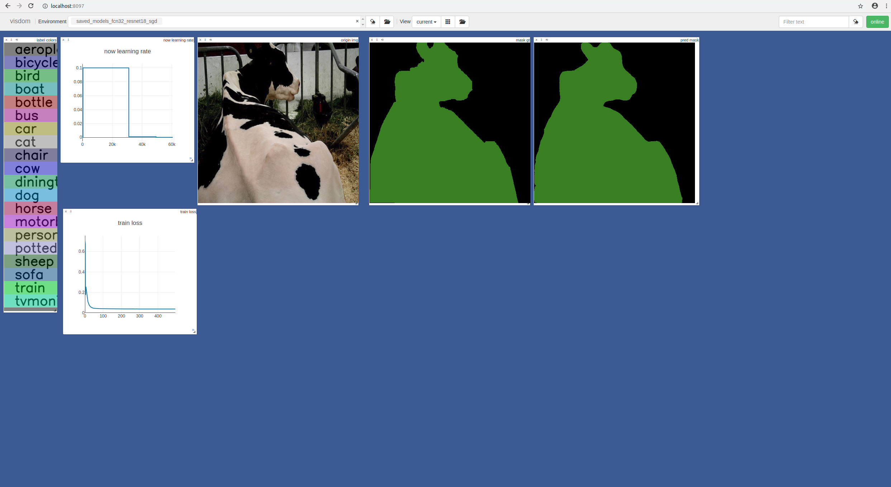
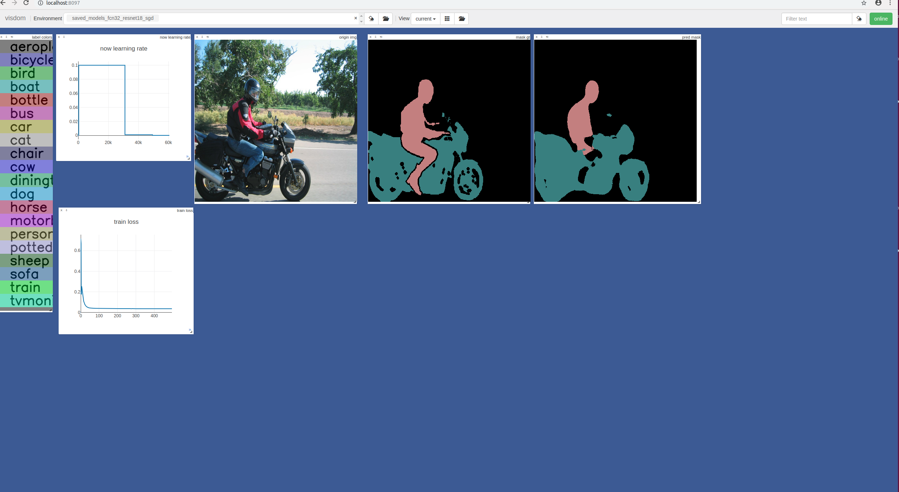
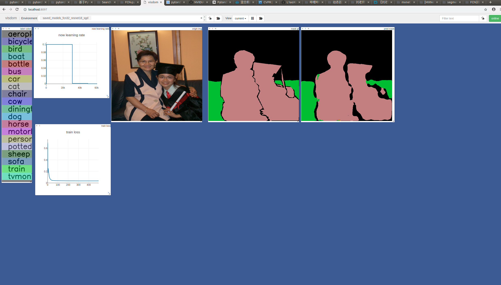
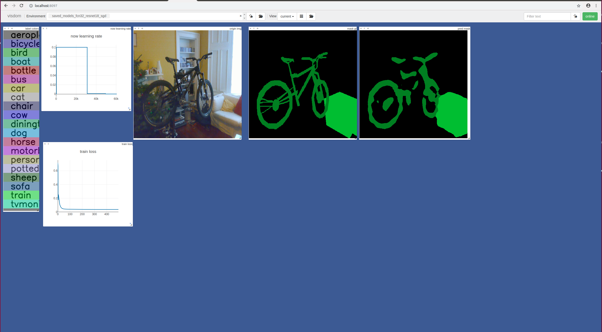
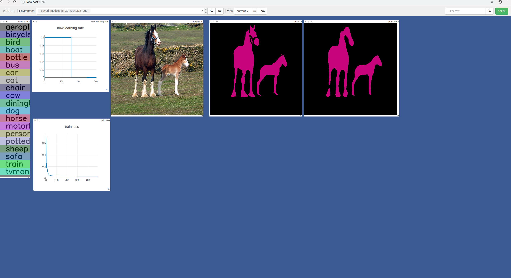
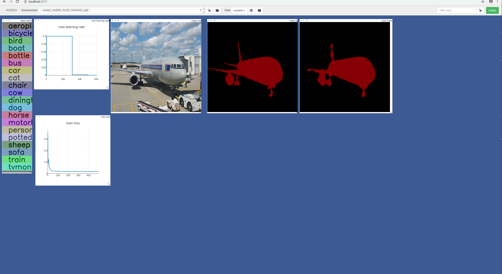
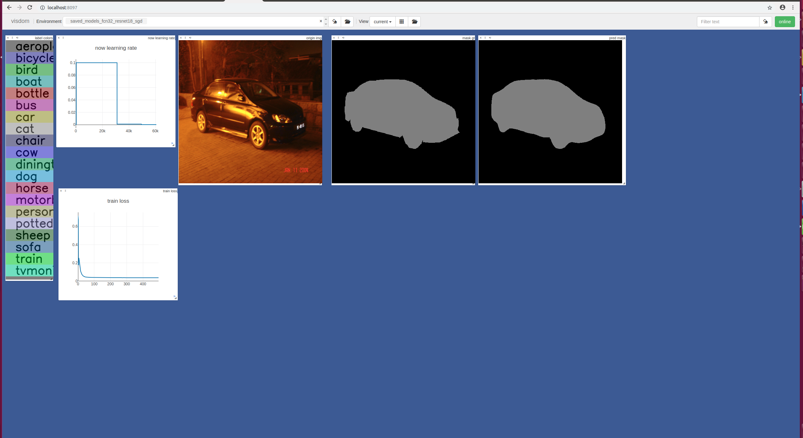
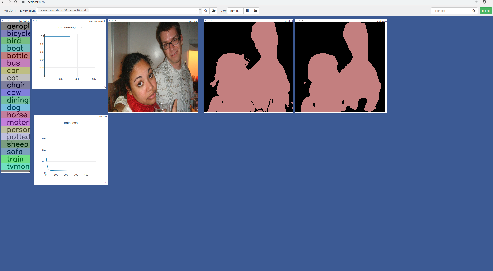
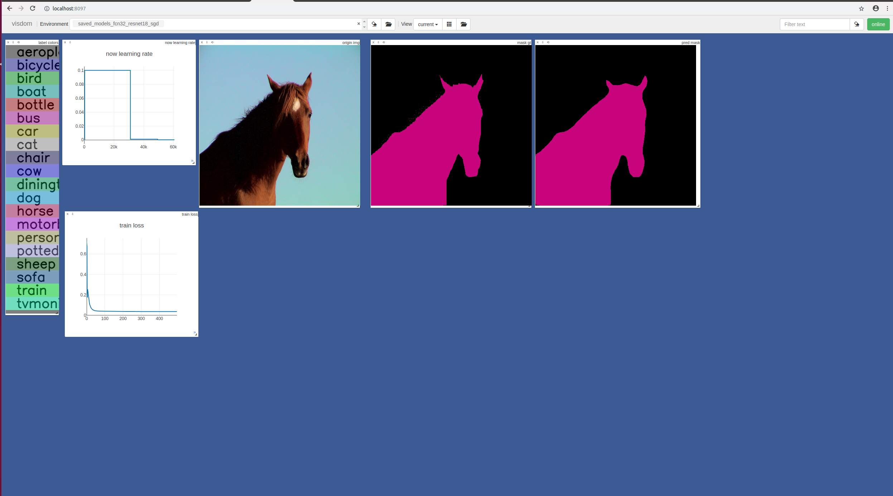
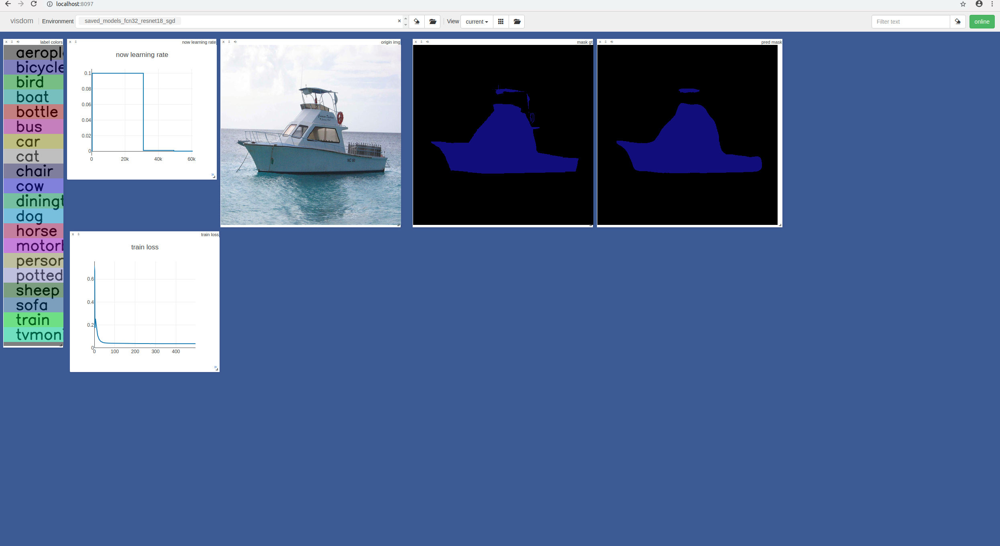

### FCN Simple Implementation by Pytorch
* backbones support: `resnet18`, `resnet50`
* finished: `FCN32s`, `FCN16s`
* visual by `visdom`

##### run train
`python train.py --config configs/fcn32_resnet18_sgd.json`

##### some visual results
* FCN32-resnet18
  * 
  * 
  * 
  * 
  * 
  * 
  * 
  * 
  * 
  * 

##### TODO
* add backbones: `densenet121`
* add `FCN8s`
* add eval scripts
* add mious
* find better train params
* improve performance

##### Requirements
* python3
* pytorch 0.4.0
* visdom
* torchsummary
* torchvision
* cv2
* PIL
* numpy